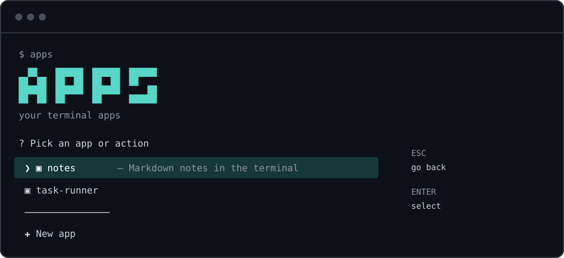

<div align="center">

<pre>
 ▄▀▀▄ █▀▀▄ █▀▀▄ █▀▀
 █▀▀█ █▄▄▀ █▄▄▀ ▀▀█
 █  █ █    █    ▄▄█
</pre>

**a terminal panel for your apps**

Create, launch, install and share console apps — one folder, one manifest, zero databases.

<p>
  <a href="https://github.com/gioahumada/apps-cli"></a>
  &nbsp;&nbsp;
  <a href="https://www.npmjs.com/package/@gioahumada/apps-cli"></a>
  &nbsp;&nbsp;
  <a href="https://github.com/gioahumada/homebrew-tap"></a>
  &nbsp;&nbsp;
  <a href="https://nodejs.org"></a>
</p>

[](https://github.com/gioahumada/apps-cli/actions)
[](https://www.npmjs.com/package/@gioahumada/apps-cli)
[](https://github.com/gioahumada/apps-cli/releases)
[](LICENSE)

</div>

---

**apps** is a tiny CLI that turns a folder (`~/apps`) into an app launcher.
Every app is just a directory with an `app.json`. No registry files, no database, no daemon — if the folder exists, the app exists.



## Features

- **Interactive panel** — launch, inspect, edit or remove apps with arrow keys. `ESC` goes back, always.
- **Scaffolding** — three templates: `script` (single shell file), `node` (Express + static frontend), `web` (Express + Vite React).
- **Install from GitHub** — `apps install user/repo` clones, validates the manifest and runs its setup.
- **Adopt existing projects** — move any repo into `~/apps` and keep a symlink at its original path.
- **Register any command** — already have `btop`, `lazygit` or any binary installed? Register it and it shows up in the list.
- **Edit apps without leaving the panel** — rename, change run command, description, setup or port.
- **AI-native** — generates an `AGENTS.md` on scaffolding, detects installed AI CLIs (claude, codex, gemini, kimi, qwen, opencode, pi, aider, amp…) and opens them in the app's folder.
- **Bilingual** — Spanish and English, auto-detected from your locale.
- **2 dependencies** — `@inquirer/prompts` and `picocolors`. That's all.

## Install

###  Homebrew (macOS / Linux)

```sh
brew install gioahumada/tap/apps-cli
```

###  npm

```sh
npm install -g @gioahumada/apps-cli
```

###  From source

```sh
git clone https://github.com/gioahumada/apps-cli.git
cd apps-cli
npm link
```

Requires Node.js ≥ 18. Installing apps from GitHub also requires `git`.

## Usage

```sh
apps                    # interactive panel
apps run <name>         # launch an app
apps new [name]         # create from a template
apps install <src>      # install from GitHub (user/repo or git URL)
apps adopt <path>       # adopt an existing folder (moves it, leaves a symlink)
apps register <cmd>     # register a command already installed on your PC
apps remove <name>      # remove an app
apps list               # plain list, script-friendly
apps help               # usage
```

Aliases: `rm` → `remove`, `ls` → `list`, `reg` → `register`.

### The panel

```
apps
└── ▣ <app>
│     ├── ▶  Launch
│     ├── ⓘ  Info
│     └── ≡  Options
│            ├── ✎  Rename            (renames folder + manifest)
│            ├── ✎  Edit description
│            ├── ✎  Edit command (run)
│            ├── ✎  Edit setup
│            ├── ✎  Edit port
│            ├── ❯  Open terminal here (a shell cd'ed into the app)
│            ├── ✦  Edit with AI       (pick from installed AI CLIs)
│            └── ✕  Remove
└── ✚  New app
      ├── ▦  From template
      ├── ⬇  Install from GitHub
      ├── ⬅  Adopt existing folder
      └── $  Register PC command
```

## The manifest: `app.json`

An app is a folder with this file. All fields except `run` are optional:

```json
{
  "name": "my-app",
  "description": "What it does",
  "version": "0.1.0",
  "author": "you",
  "run": "npm run dev",
  "setup": "npm install",
  "port": 3000
}
```

| Field | Required | Purpose |
|---|---|---|
| `run` | ✅ | Command executed by `apps run` (via shell, in the app folder) |
| `setup` | – | Command run once after `new` / `install` |
| `port` | – | Shown as `http://localhost:<port>` when launching |
| `name` | – | Defaults to the folder name |
| `description`, `version`, `author` | – | Shown in the panel and in `Info` |

## Templates

| Template | What you get |
|---|---|
| `script` | One executable `main.sh` with colors. Minimal and dependency-free. |
| `node` | Express server + static `public/` frontend, `node --watch` dev mode. |
| `web` | Full stack: Express API + Vite React client with `/api` proxy and a root runner. |

All templates ask whether to include an **`AGENTS.md`** — a short file with the app's commands and working rules, read automatically by AI coding agents (claude, codex, pi, opencode, gemini…).

## AI integration

- After creating or installing an app, **apps** offers to open it with an AI agent.
- The selector only shows CLIs **actually installed** on your machine (detected from `PATH`): claude, codex, gemini, kimi, qwen, opencode, pi, aider, amp, cursor-agent, copilot.
- Every app has **✦ Edit with AI** in its options menu — same selector, opens the agent inside the app's folder.

## Configuration

| Variable | Default | Purpose |
|---|---|---|
| `APPS_HOME` | `~/apps` | Where apps live |
| `APPS_LANG` | auto (`LANG`) | Force language: `es` or `en` |
| `APPS_AI` | – | Preselect an AI CLI in the selector |

## Design principles

- **The directory is the registry.** Delete the folder, the app is gone. Copy the folder, the app is installed.
- **Stdlib first.** Two runtime dependencies; everything else is Node.js built-ins.
- **Symlink-safe.** Removing an adopted app removes the link, never the target.

## License

[MIT](LICENSE)
